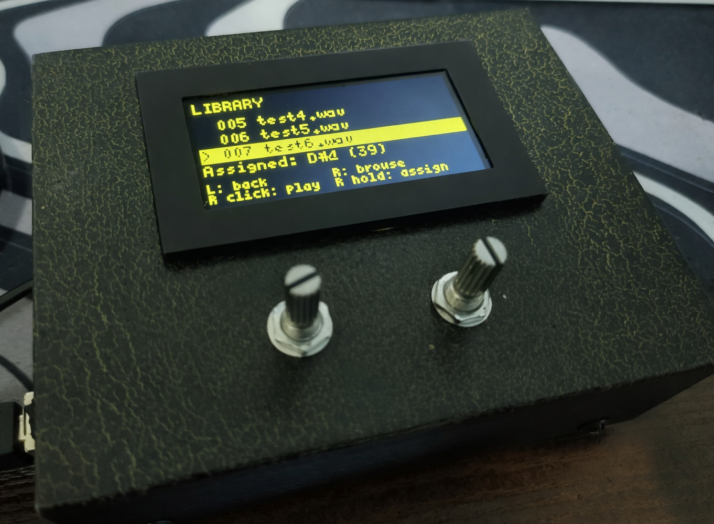

# Samplotron



Samplotron is a hands-on hardware sampler for musicians and producers: load your own WAV sounds from SD, assign them to MIDI notes, perform with immediate control over volume and shot/loop behavior, and save your live setup in seconds. Start with the workflow guide here: [`docs/manual.md`](docs/manual.md).

[](https://github.com/jakubthedeveloper/Samplotron/actions/workflows/build-main.yml)

[Latest firmware.bin](https://github.com/jakubthedeveloper/Samplotron/releases/download/main-latest/firmware.bin)

Samplotron is an `ESP32 (ESP-WROVER-KIT)` sampler: it plays WAV files from SD, maps samples to MIDI notes, and stores device configuration on the card.

Architecture note: `src/main.cpp` is a thin entrypoint, while runtime orchestration is implemented in `src/sampler_app.cpp` and dedicated modules.

## Current Features

- WAV sample playback from `/samples` on SD.
- 8-voice polyphony with deterministic oldest-voice stealing.
- Playback format for assigned samples is enforced to WAV PCM16, 44.1kHz, mono.
- Audio playback runs in a dedicated FreeRTOS task/core with trigger events passed by queue.
- SD stream refill runs in a dedicated task; audio-domain stream reads are served from RAM read-ahead buffers.
- OLED UI with 2 encoders (via MCP23017).
- On-device MIDI note to sample assignment.
- Per-sample `SHOT/LOOP` playback mode (stored in config).
- Persistent assignments, sample volumes, and playback mode in `sampler_config.json`.
- Automatic RAM preload for short samples (faster trigger response).

## Quick Start

1. Requirements:
- `PlatformIO CLI` (`pio`) or PlatformIO IDE extension.
- `esp-wrover-kit` board (PSRAM is used).
- Connected hardware: ES8388, SSD1309 OLED (I2C), MCP23017 + 2 encoders, MIDI IN, SD card.
2. Prepare SD card (FAT32):
- create `/samples`,
- copy `.wav` files into `/samples`,
- optionally add `sampler_config.json` (if missing, firmware starts with defaults).
3. Flash firmware:
- `make upload-main`
4. Open serial log:
- `make monitor`

## Flashing Prebuilt Firmware (from GitHub Releases)

1. Download these files from release tag [`main-latest`](https://github.com/jakubthedeveloper/Samplotron/releases/tag/main-latest):
- `firmware.bin`
- `bootloader.bin`
- `partitions.bin`
- `boot_app0.bin`
2. Install esptool:
- `python -m pip install esptool`
3. Flash device (replace `/dev/ttyUSB0` with your port, e.g. `COM3` on Windows):

```bash
python -m esptool --chip esp32 --port /dev/ttyUSB0 --baud 921600 write_flash -z \
  0x1000 bootloader.bin \
  0x8000 partitions.bin \
  0xe000 boot_app0.bin \
  0x10000 firmware.bin
```

## Controls (Short Version)

- Main screen: `LIB`, optional `VOL` + `SHOT/LOOP` (when a sample is active), optional `SAVE` (when dirty).
- `VOL`: range `0..100`, step `5` per encoder tick.
- `SHOT/LOOP`: toggles playback mode for the active sample.
- Library: browse samples and preview playback.
- Preview requests are queued through `sample_loader` before playback routing.
- Hold right encoder button in Library: MIDI note assignment mode.
- `SAVE`: writes assignments, volumes, and playback mode to SD.

## Debug Firmware

- Input debug: `make upload-debug`
- MIDI debug: `make upload-debug-midi`

## Technical Documentation

Hardware details, pinout, configuration, and hardcoded values: [`docs/documentation.md`](docs/documentation.md).
