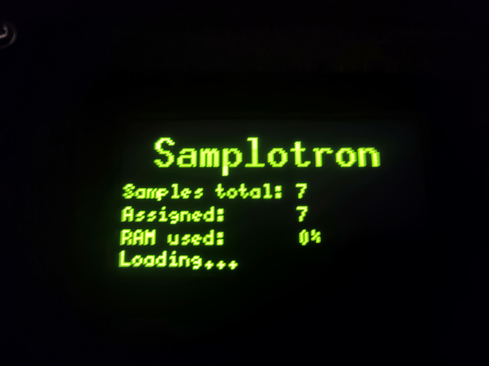
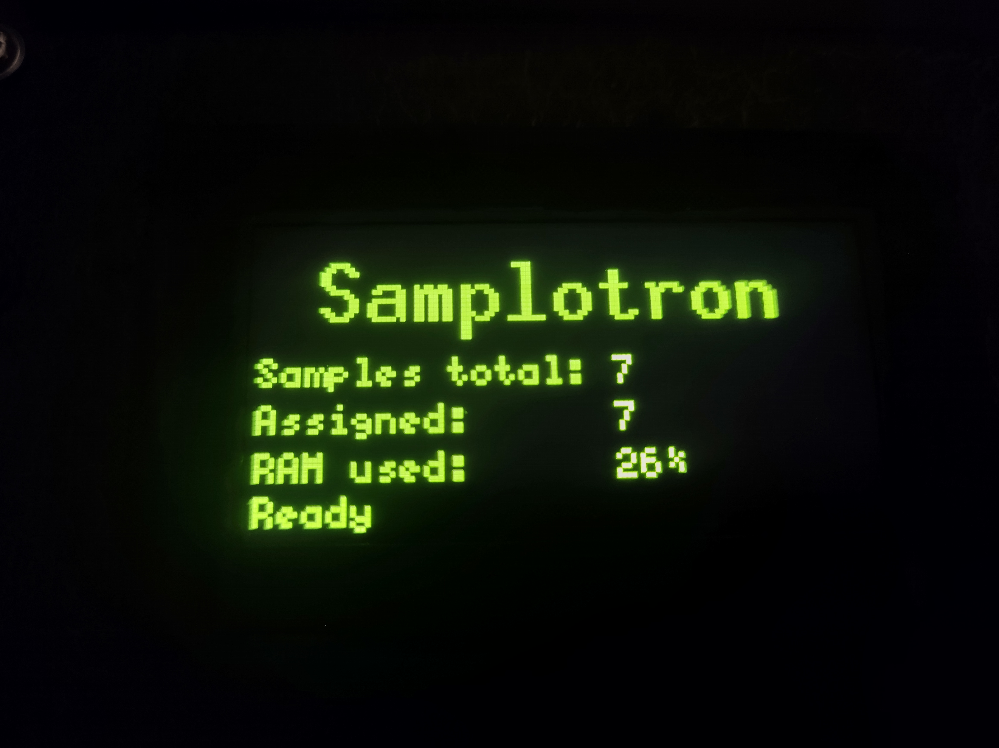
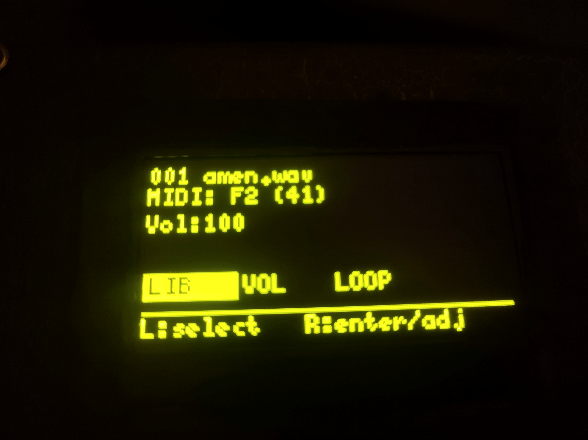
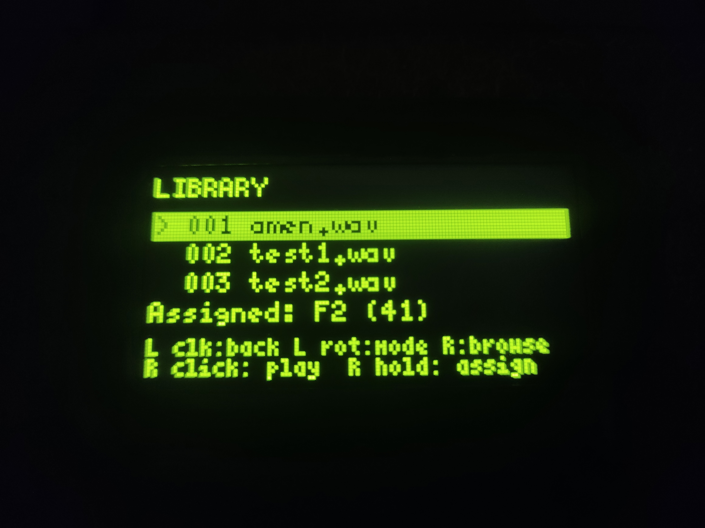
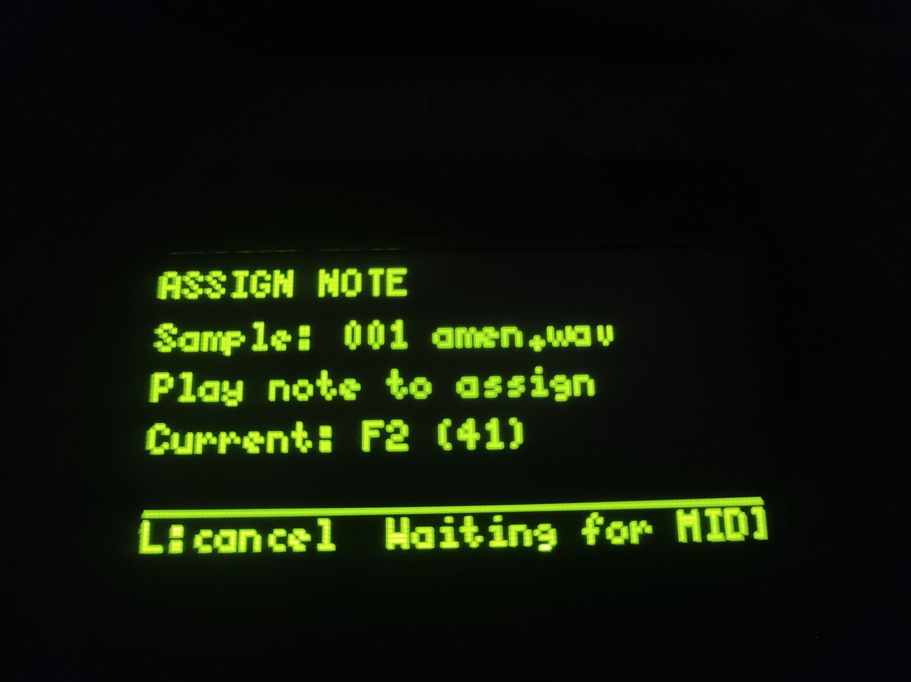
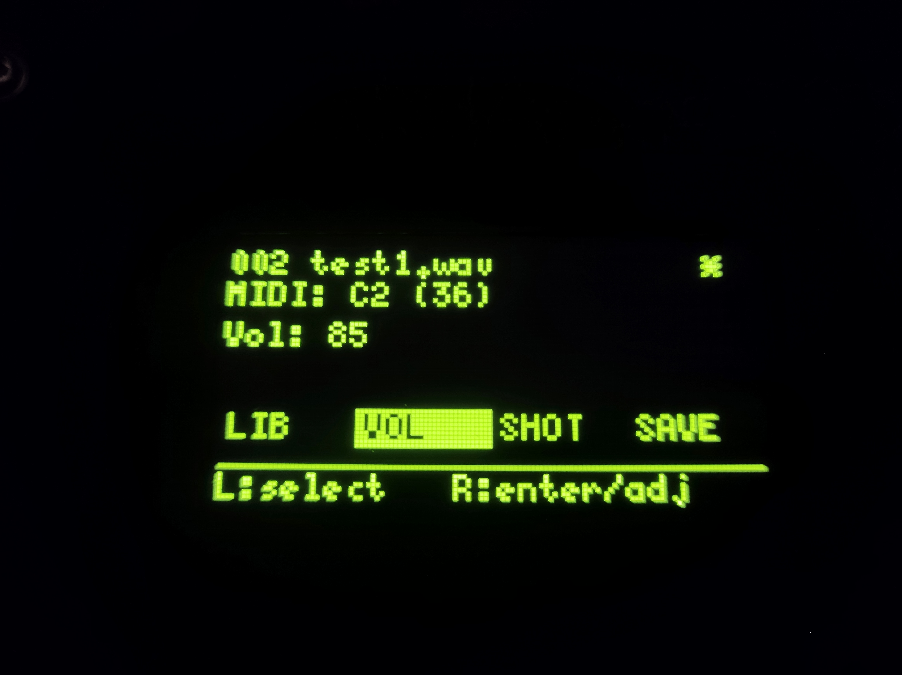
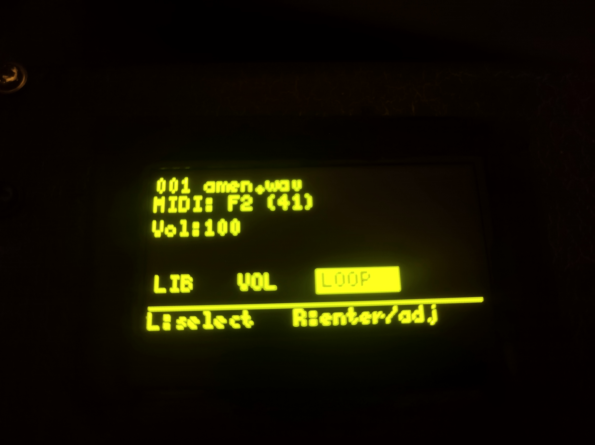
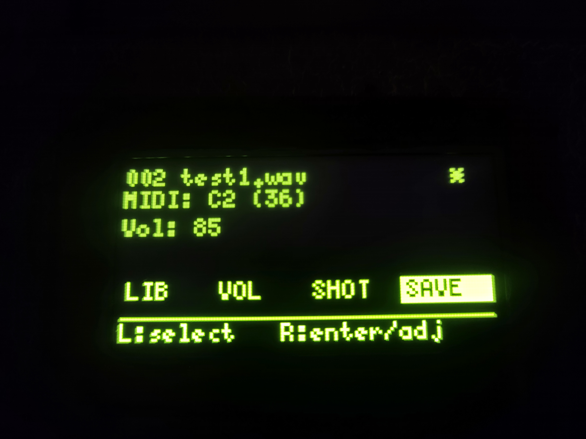
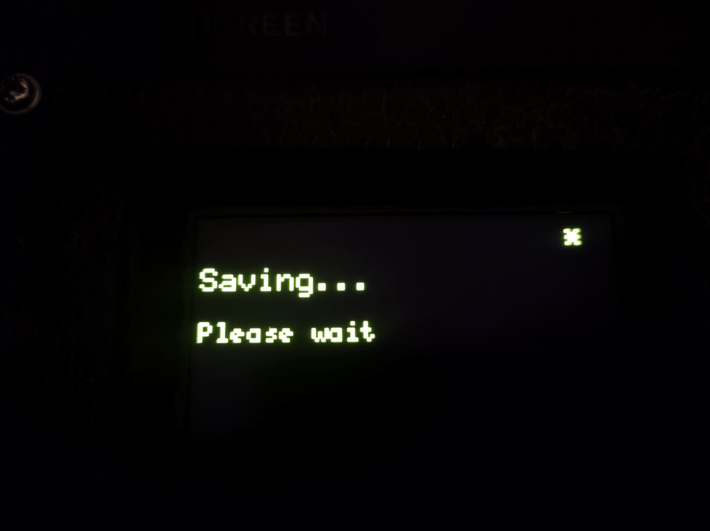

# Samplotron Manual (Musician Workflow)

This guide focuses on making music with Samplotron: loading sounds, mapping them to MIDI, shaping playback, and saving your setup. For SD card preparation and firmware installation, start with the [README](../README.md#preparing-samples-and-first-use).

Connect the isolated mono output jack to your mixer and start at a low monitoring volume. Inside Samplotron, this jack is fed from **one channel of headphones out through a 600:600 transformer**. Do not use the AudioKit's separate L/R speaker terminals: their Class-D amplifiers produce a switching, speaker-level signal unsuitable for this connection. Line-in and microphones are disabled; load samples from the SD card.

## 1. Power On and Wait for Ready

When you boot the device, you will first see loading status.

When the status changes to `Ready`, you can start working.

## 2. Understand the Main Performance Screen

This is your performance view: selected sample, assigned MIDI note, and menu tabs (`LIB`, `VOL`, `SHOT/LOOP`, `SAVE` when there are unsaved changes).

Control feel:

- Left encoder: move between menu tabs (`L:select`).
- Right encoder/button: enter and adjust the selected function (`R:enter/adj`).
- Left click: open the output waveform view. Rotate either encoder or press a button to return; MIDI and keypad playback continue in this view.

## 3. Browse the Library and Preview Sounds

Go to `LIB` to browse your sample list and audition sounds before assigning.

In `LIB`:

- Right rotate: browse samples.
- Right click: play preview.
- Left click: go back.

## 4. Assign a Sample to a MIDI Note

While a sample is selected in `LIB`, hold the right button to enter note assignment.

Then play a note on your MIDI controller or press a key on the built-in matrix keypad. That note becomes the trigger for the selected sample.

The 16 keypad keys send notes `36..51` in the measured physical key order. They use the same assignments and playback behavior as external MIDI. Hold the right button in `LIB`, press the desired keypad key, and save your configuration as usual. Releasing a key does not stop a sample or loop.

## 5. Optional: Set a Panic Note

In `LIB`, rotate the left encoder to switch from sample mode to `PANIC MODE`, then hold the right button to assign a panic trigger note.

Use this note to fade out every sound and clear pending triggers during live play. Choose a separate note from your sample assignments: panic takes priority if they share a note.

## 6. Shape Playback Per Sample

### Volume

Trigger or preview a sample, select `VOL` on the main screen, and rotate the right encoder to set its level from 0 to 100 in steps of 5. The new level applies to subsequent triggers. MIDI velocity does not change the volume. At `VOL=100`, a single sample plays at its original digital level. When sounds overlap, an automatic limiter reduces the mixed level only as needed to keep digital sample peaks within full scale; quiet overlaps do not automatically turn everything down. Its short release can briefly keep the mix quieter after a loud peak. Start with the physical output volume low after updating from older firmware: playback is now louder.

### Shot or Loop

Select `SHOT`/`LOOP` on the main screen and click or rotate the right encoder to toggle the mode. `SHOT` plays once; `LOOP` repeats the sample. Triggering the same sample again restarts it. Releasing a MIDI or keypad key does not stop the sound.

To stop a loop, change that sample to `SHOT`, or use your panic note to stop all sounds. Loops are not synchronized to MIDI clock.

## 7. Save Your Session

After assignments or sound tweaks, `SAVE` appears on the main screen.

Press save and wait until writing is complete. Save between performances: if playback does not finish within 3 seconds, saving requests a stop before preparing samples again.

Saving preserves note assignments, assigned sample volumes, playback modes, and the panic note. Assign a sample before saving if you want to retain its volume setting.

## 8. Practical Live Workflow

1. Boot and wait for `Ready`.
2. Open `LIB`, browse and preview samples.
3. Assign key samples to MIDI notes.
4. Set per-sample `VOL` and `SHOT/LOOP`.
5. Configure a `PANIC MODE` note if you play live.
6. Save before performance or power-off.
